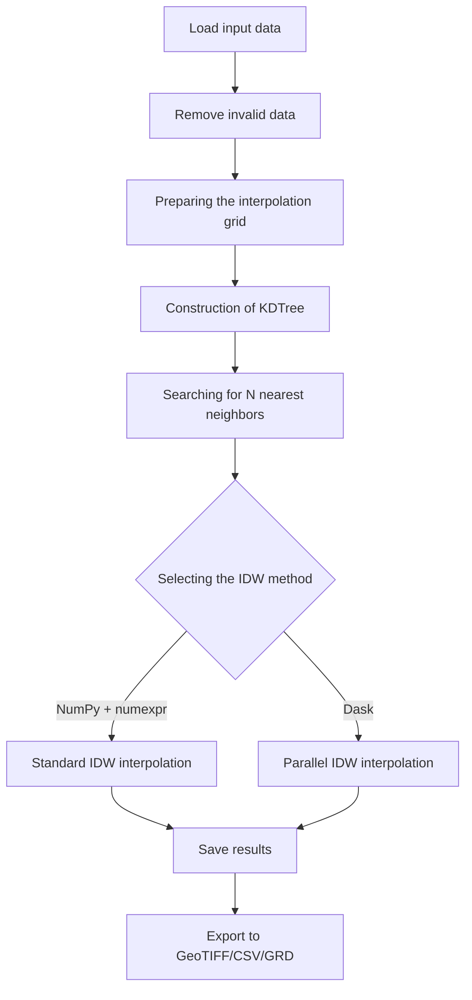
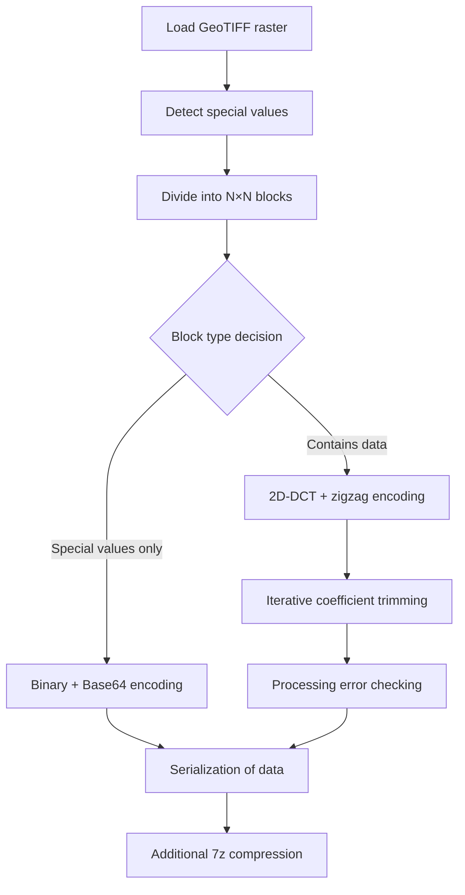

# FIDWaC: Fast Inverse Distance Weighting and Compression

**FIDWaC (Fast Inverse Distance Weighting and Compression)** is a Python toolkit for:
- **Fast creation of continuous surfaces** (rasters) from scattered measurement points using the IDW (Inverse Distance Weighting) method
- **Lossy compression** of raster data (GeoTIFF) using **Discrete Cosine Transform (DCT)** and zigzag encoding

The package is designed for efficient processing and storage of geospatial data in fields such as:
- Bathymetry analysis
- Digital terrain modeling
- Shoreline monitoring
- Hydrology, climatology, and other applications requiring large spatial datasets

## Table of Contents
1. [Features](#features)
2. [Tool Structure](#structure)
   1. [interpolation_FIT.py](#interpolation)
   2. [compress_function.py](#compression)
3. [Operation Diagrams](#schemes)
4. [System Requirements](#requirements)
5. [Installation](#installation)
6. [Configuration and Usage](#configuration)
7. [Key Functions](#key-functions)
8. [Examples](#examples)
9. [Advantages and Applications](#benefits)

---

<a name="features"></a>
## 1. Features

### High-Performance IDW Interpolation

- **Dual Processing Options**:
  - NumPy + numexpr for standard datasets
  - Dask for parallel processing of large datasets
- **Efficient Spatial Search** with `scipy.spatial.cKDTree`
- **Flexible Parameter Selection**:
  - Maximum search radius (`RMAX`)
  - Maximum number of neighbors (`NMAX`)
  - Minimum number of observations (`NMIN`)
- **Multiple Input Formats**: `.shp`, `.las`, `.laz`, `.txt`, `.csv`
- **Multiple Output Formats**: GeoTIFF, CSV, Surfer GRD

### Advanced Raster Compression

- **2D-DCT** (Discrete Cosine Transform) with zigzag coefficient encoding
- **Quality-Controlled Compression** with iterative coefficient pruning to achieve preset error thresholds
- **Intelligent Handling of NoData Values** (-9999) and zero values using binary representation with Base64 compression
- **Optimized Storage** through binary serialization (pickle, `.npy`) with 7z archiving

---

<a name="structure"></a>
## 2. Tool Structure

<a name="interpolation"></a>
### 2.1 `interpolation_FIT.py`

Script for advanced spatial data interpolation using IDW method and KDTree optimization.

**Key Components**:
- Configuration management through `config.json`
- Data preprocessing (NaN and -9999 removal)
- Meshgrid generation based on data boundaries
- KDTree implementation for efficient neighbor search
- Dual interpolation engines (NumPy/numexpr and Dask)
- Multi-format export functionality

**Core Functions**:
```python
def calculate_idw(distance: np.ndarray) -> np.ndarray:
    """Calculate IDW interpolation using NumExpr for optimized performance"""
    w = ne.evaluate(f"{weights}/(distance)**2") 
    a = np.nansum(w * value_data, axis=1)
    b = np.nansum(w, axis=1)
    idw = ne.evaluate("a/b")
    return idw

def calculate_idw_dask(distance: np.ndarray, weights: float, value_data: np.ndarray) -> np.ndarray:
    """Calculate IDW interpolation using Dask for parallel processing"""
    distance_dask = da.from_array(distance, chunks='auto')
    value_data_dask = da.from_array(value_data, chunks='auto')        
    
    # Handle NaN values
    distance_dask = da.nan_to_num(distance_dask)
    value_data_dask = da.nan_to_num(value_data_dask)
    no_nan = 1e-10  # Epsilon value to avoid division by zero
    
    # Calculate IDW
    w = weights/(distance_dask ** 2 + no_nan)
    a = da.nansum(w * value_data_dask, axis=1)
    b = da.nansum(w, axis=1)
    idw = a/b  
    return idw.compute()
```

**Processing Workflow**:
1. Data loading and cleaning
2. Grid preparation based on data extents
3. KDTree construction for spatial indexing
4. Nearest neighbors search for each grid point
5. Distance-based weight calculation
6. IDW interpolation via optimized numerical processing
7. Output generation in selected formats

<a name="compression"></a>
### 2.2 `compress_function.py`

Script for lossy compression of raster data using DCT and zigzag encoding with quality control.

**Key Components**:
- Configuration management through `config.json`
- Special value detection and handling (0, -9999, NaN)
- N×N block-based processing
- 2D-DCT transformation with coefficient optimization
- RLE (Run-Length Encoding) for binary masks
- Multi-threaded processing for performance

**Core Functions**:
```python
def dct2(a: np.ndarray) -> np.ndarray:
    """Performs a two-dimensional Discrete Cosine Transform (DCT)"""
    return dct(dct(a.T, norm="ortho", type=type_dct).T, norm="ortho", type=type_dct)

def idct2(a: np.ndarray) -> np.ndarray:
    """Performs an inverse two-dimensional Discrete Cosine Transform (IDCT)"""
    return idct(idct(a.T, norm="ortho", type=type_dct).T, norm="ortho", type=type_dct)

def to_zigzag(matrix: np.ndarray) -> np.ndarray:
    """Converts a 2D matrix to a 1D vector using zig-zag scanning"""
    # Implementation processes the matrix in diagonal traversal pattern
    # to concentrate energy in the early coefficients
    
def refine_dct_array(org_dct_zigzag, accuracy, agt, max_value, split_point, original_matrix):
    """Optimizes the number of DCT coefficients to achieve desired accuracy"""
    # Uses binary search to find optimal number of coefficients
    # while maintaining error below the specified threshold
```

**Processing Workflow**:
1. Raster data loading
2. Special value identification and masking
3. Division into N×N processing blocks
4. Block classification and processing:
   - Special value-only blocks: binary encoding
   - Mixed blocks: DCT with special value handling
   - Data-only blocks: full DCT processing
5. Zigzag encoding of DCT coefficients
6. Iterative coefficient pruning for quality control
7. Binary serialization with 7z compression

---

<a name="schemes"></a>
## 3. Operation Diagrams

### 3.1 Interpolation Workflow



### 3.2 Compression Workflow



---

<a name="requirements"></a>
## 4. System Requirements

### Dependencies

- **Python** 3.7+
- **Core Libraries**:
  - NumPy, SciPy: Array operations, KDTree, DCT
  - numexpr: Fast numerical expressions
  - Dask: Parallel computing
  - rasterio: GeoTIFF handling
- **File Format Support**:
  - Pandas: Tabular data
  - Shapefile: Vector data
  - laspy: LiDAR point clouds
- **Additional Tools**:
  - py7zr: 7z compression
  - tqdm: Progress visualization

### Hardware Recommendations

- **CPU**: Multi-core processor (recommended for Dask mode)
- **RAM**: 8GB minimum, 16GB+ recommended for larger datasets
- **Storage**: Sufficient space for input/output data
- **Platform**: Compatible with Windows and Linux

---

<a name="installation"></a>
## 5. Installation

```bash
# Clone the repository
git clone https://github.com/yourusername/FIDWaC.git
cd FIDWaC

# Create a virtual environment (optional but recommended)
python -m venv venv
source venv/bin/activate  # On Windows: venv\Scripts\activate

# Install dependencies
pip install -r requirements.txt
```

---

<a name="configuration"></a>
## 6. Configuration and Usage

Configuration is managed through the `config.json` file:

```json
{
  "results_directory": "./results/",
  "source_directory": "./source/",
  "z_field_name": "z",
  "N": 12,
  "resolution": 0.5,
  "max_distance": 50,
  "leafsize": 16,
  "weights": 1,
  "rasterCrs": "EPSG:2180",
  "matrix": 8,
  "accuracy": 0.01,
  "decimal": 2,
  "type_dct": 2,
  "save_data_to_shp": false,
  "idw_dask": true,
  "idw_numpy": false,
  "knn_calculate": false,
  "knn_image": false,
  "interpolation_image_create": true,
  "csv_result": true,
  "surfer_grd": false
}
```

### Using interpolation_FIT.py

```bash
python interpolation_FIT.py path/to/your/data.shp
```

### Using compress_function.py

```bash
# For compression
python compress_function.py path/to/your/geotiff.tif

# For decompression (automatically detected by .7z extension)
python compress_function.py path/to/your/compressed_file.7z
```

---

<a name="key-functions"></a>
## 7. Key Functions

### Interpolation

- **near_divided()**: Rounds values to nearest divisible by resolution
- **calculate_idw()**: Optimized IDW using numexpr
- **calculate_idw_dask()**: Parallel IDW using Dask

### Compression

- **dct2()** / **idct2()**: 2D DCT and inverse DCT
- **to_zigzag()** / **from_zigzag()**: Zigzag encoding/decoding
- **refine_dct_array()**: Coefficient optimization for quality control
- **encode_mask_rle()** / **decode_mask_rle()**: Run-length encoding for binary masks

---

<a name="examples"></a>
## 8. Examples

### Interpolation Example

```python
# Load configuration
with open('config.json', 'r') as f:
    config = json.load(f)

# Prepare data
data = np.loadtxt('sample_points.csv', delimiter=',', skiprows=1)
# Clean data (remove NaN and -9999)
data = data[~np.any(np.isnan(data) | (data == -9999), axis=1)]
x, y, z = data[:,0], data[:,1], data[:,2]

# Create KDTree
tree = spatial.cKDTree(data[:,:2], leafsize=config['leafsize'])

# Query KDTree for nearest neighbors
distance, index = tree.query(grid_points, 
                            k=config['N'],
                            distance_upper_bound=config['max_distance'])

# Perform IDW interpolation
if config['idw_dask']:
    result = calculate_idw_dask(distance, config['weights'], value_data)
else:
    result = calculate_idw(distance)
```

### Compression Example

```python
# Load a GeoTIFF file
with rasterio.open('input.tif') as src:
    image = src.read(1)
    transform = src.transform
    crs = src.crs

# Divide into blocks
blocks = sliding_window_view(image, (N, N))

# Process each block
for block in blocks:
    # Apply DCT
    dct_coeffs = dct2(block)
    
    # Convert to zigzag format
    zigzag_coeffs = to_zigzag(dct_coeffs)
    
    # Refine coefficients to achieve desired accuracy
    refined_coeffs, error, _ = refine_dct_array(
        zigzag_coeffs, accuracy, N*N//2, float('inf'), N*N//4, block)
```

---

<a name="benefits"></a>
## 9. Advantages and Applications

### Advantages

- **High Performance**: Optimized algorithms for processing large geospatial datasets
- **Memory Efficiency**: Dask-based processing for datasets larger than available RAM
- **Quality Control**: Precise control over compression accuracy
- **Format Flexibility**: Support for multiple input/output formats
- **Compression Ratio**: Significant file size reduction while maintaining quality

### Applications

- **Bathymetry**: Processing and storing sonar data from water bodies
- **Terrain Modeling**: Creating DEM/DTM from LiDAR or photogrammetry
- **Environmental Monitoring**: Processing time-series data for change detection
- **Hydrology**: Managing flood mapping and hydrological modeling data
- **GIS Data Management**: Efficient storage of large raster catalogs

---

## License

This project is licensed under the MIT License - see the LICENSE file for details.

## Contributing

Contributions are welcome! Please feel free to submit a Pull Request.

## Citation

If you use this software in your research, please cite:

```
@software{fidwac2023,
  author = {Author Name},
  title = {FIDWaC: Fast Inverse Distance Weighting and Compression},
  year = {2023},
  url = {https://github.com/yourusername/FIDWaC}
}
