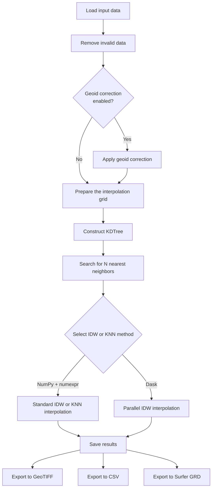
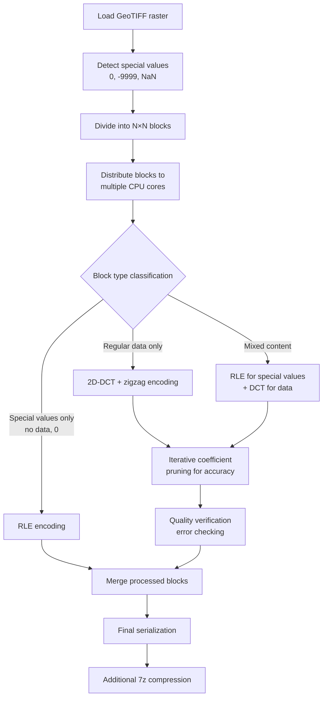
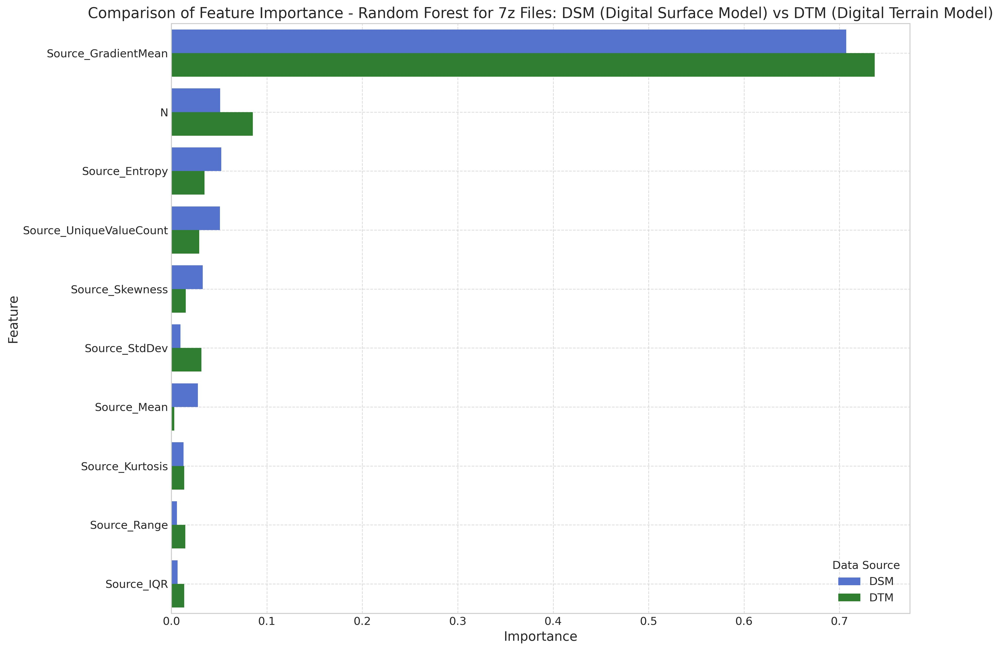
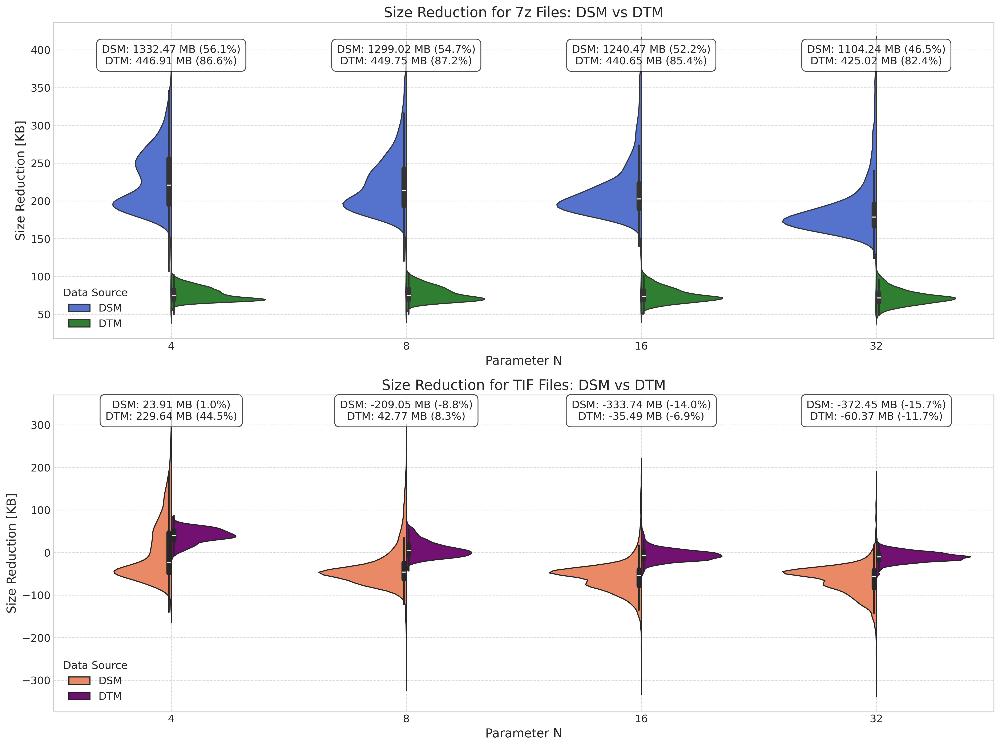

# FIDWaC: Fast Inverse Distance Weighting and Compression

**FIDWaC (Fast Inverse Distance Weighting and Compression)** is a Python toolkit for:
- **Fast creation of continuous surfaces** (rasters) from scattered measurement points using the IDW (Inverse Distance Weighting) method
- **Lossy compression** of raster data (GeoTIFF) using **Discrete Cosine Transform (DCT)** and zigzag encoding

The package is designed for efficient processing and storage of geospatial data in fields such as:
- Bathymetry analysis
- Digital terrain modeling
- Shoreline monitoring
- Hydrology, climatology, and other applications requiring large spatial datasets

## Table of Contents
1. [Features](#features)
2. [Tool Structure](#structure)
   1. [interpolation.py](#interpolation)
   2. [compress_function.py](#compression)
3. [Operation Diagrams](#schemes)
4. [System Requirements](#requirements)
5. [Installation](#installation)
6. [Configuration and Usage](#configuration)
   1. [JSON Configuration System](#json-config)
   2. [Interpolation Configuration](#interp-config)
   3. [Compression Configuration](#comp-config)
   4. [Usage Examples](#usage)
   5. [Batch Processing](#batch)
7. [Multi-threading Capabilities](#multi-threading)
8. [Key Functions](#key-functions)
9. [Examples](#examples)
10. [Advantages and Applications](#benefits)
11. [Test](#tests)

---

<a name="features"></a>
## 1. Features

### High-Performance IDW Interpolation

- **Dual Processing Options**:
  - NumPy + numexpr for standard datasets
  - Dask for parallel processing of large datasets
- **Efficient Spatial Search** with `scipy.spatial.cKDTree`
- **Flexible Parameter Selection**:
  - Maximum search radius (`max_distance`)
  - Maximum number of neighbors (`N`)
  - Grid resolution (`resolution`)
- **Multiple Input Formats**: `.shp`, `.las`, `.laz`, `.txt`, `.csv`
- **Multiple Output Formats**: GeoTIFF, CSV, Surfer GRD
- **Multi-threaded Processing**: Utilizes all available CPU cores for spatial queries
- **Geoid Correction**: Option to apply geoid correction with configurable CRS

### Advanced Raster Compression

- **2D-DCT** (Discrete Cosine Transform) with zigzag coefficient encoding
- **Quality-Controlled Compression** with iterative coefficient pruning to achieve preset error thresholds
- **Intelligent Handling of NoData Values** (-9999) and zero values using RLE representation
- **Optimized Storage** through serialization (RLE) with .json file and 7z archiving
- **Parallel Block Processing**: Multi-threaded compression of image blocks
- **Configurable Accuracy**: Set compression accuracy via configuration

---

<a name="structure"></a>
## 2. Tool Structure

<a name="interpolation"></a>
### 2.1 `interpolation.py`

Script for advanced spatial data interpolation using IDW method and KDTree optimization.

**Key Components**:
- Configuration management through `interpolation/config.json`
- Data preprocessing (NaN and -9999 removal)
- Optional filtering of LAS/LAZ data based on classification codes
- Optional geoid correction with configurable coordinate reference systems
- Meshgrid generation based on data boundaries
- KDTree implementation for efficient neighbor search
- Dual interpolation engines (NumPy/numexpr and Dask)
- Multi-format export functionality
- Multi-threaded KDTree queries with `workers=-1` parameter

**Core Functions**:
```python
def calculate_idw(distance: np.ndarray) -> np.ndarray:
    """Calculate IDW interpolation using NumExpr for optimized performance"""
    w = ne.evaluate(f"{weights}/(distance)**2") 
    a = np.nansum(w * value_data, axis=1)
    b = np.nansum(w, axis=1)
    idw = ne.evaluate("a/b")
    return idw

def calculate_idw_dask(distance: np.ndarray, weights: float, value_data: np.ndarray) -> np.ndarray:
    """Calculate IDW interpolation using Dask for parallel processing"""
    distance_dask = da.from_array(distance, chunks='auto')
    value_data_dask = da.from_array(value_data, chunks='auto')        
    
    # Handle NaN values
    distance_dask = da.nan_to_num(distance_dask)
    value_data_dask = da.nan_to_num(value_data_dask)
    no_nan = 1e-10  # Epsilon value to avoid division by zero
    
    # Calculate IDW
    w = weights/(distance_dask ** 2 + no_nan)
    a = da.nansum(w * value_data_dask, axis=1)
    b = da.nansum(w, axis=1)
    idw = a/b  
    return idw.compute()
```

**Processing Workflow**:
1. Data loading and cleaning
2. Optional filtering of point cloud data by classification code (for LAS/LAZ)
3. Optional geoid correction based on configuration
4. Grid preparation based on data extents
5. KDTree construction for spatial indexing
6. Nearest neighbors search for each grid point (multi-threaded)
7. Distance-based weight calculation
8. IDW interpolation via optimized numerical processing (parallel with Dask)
9. Optional smoothing of results
10. Output generation in selected formats

<a name="compression"></a>
### 2.2 `compress_function.py`

Script for lossy compression of raster data using DCT and zigzag encoding with quality control.

**Key Components**:
- Configuration management through `compression/config.json`
- Special value detection and handling (0, -9999, NaN)
- N×N block-based processing with configurable matrix size
- 2D-DCT transformation with coefficient optimization
- RLE (Run-Length Encoding) for masks
- Multi-threaded block processing with Python's `multiprocessing` module
- Configurable decimal precision for compression

**Core Functions**:
```python
def dct2(a: np.ndarray) -> np.ndarray:
    """Performs a two-dimensional Discrete Cosine Transform (DCT)"""
    return dct(dct(a.T, norm="ortho", type=type_dct).T, norm="ortho", type=type_dct)

def idct2(a: np.ndarray) -> np.ndarray:
    """Performs an inverse two-dimensional Discrete Cosine Transform (IDCT)"""
    return idct(idct(a.T, norm="ortho", type=type_dct).T, norm="ortho", type=type_dct)

def to_zigzag(matrix: np.ndarray) -> np.ndarray:
    """Converts a 2D matrix to a 1D vector using zig-zag scanning"""
    # Implementation processes the matrix in diagonal traversal pattern
    # to concentrate energy in the early coefficients
    
def refine_dct_array(org_dct_zigzag, accuracy, agt, max_value, split_point, original_matrix):
    """Optimizes the number of DCT coefficients to achieve desired accuracy"""
    # Uses search to find optimal number of coefficients
    # while maintaining error below the specified threshold
```

**Processing Workflow**:
1. Raster data loading
2. Special value identification and masking
3. Division into N×N processing blocks (configurable via config.json)
4. Parallel processing of blocks using multiple CPU cores:
   - Special value-only blocks: by RLE encoding
   - Mixed blocks: DCT with special value handling
   - Data-only blocks: full DCT processing
5. Zigzag encoding of DCT coefficients
6. Iterative coefficient pruning for quality control based on accuracy setting
7. RLE serialization with JSON file creation and 7z compression

---

<a name="schemes"></a>
## 3. Operation Diagrams

### 3.1 Interpolation Workflow



### 3.2 Compression Workflow



---

<a name="requirements"></a>
## 4. System Requirements

### Dependencies

- **Python** 3.7+
- **Core Libraries**:
  - NumPy, SciPy: Array operations, KDTree, DCT
  - numexpr: Fast numerical expressions
  - Dask: Parallel computing
  - rasterio: GeoTIFF handling
- **File Format Support**:
  - **Interpolation**
    - Txt,Csv: Point data with sep=' '
    - Shapefile: Vector data
    - laspy: LiDAR point clouds
  - **Compression**
    - GeoTif: raster with georefernce
    - Asc GRID: grid
- **Additional Tools**:
  - py7zr: 7z compression
  - tqdm: Progress visualization

### Hardware Recommendations

- **CPU**: Multi-core processor (recommended for Dask mode and parallel compression)
- **RAM**: 16GB minimum, 64GB+ recommended for larger datasets
- **Storage**: Sufficient space for input/output data
- **Platform**: Compatible with Windows and Linux

The application works best on **Linux** or on **Windows in WSL2**.  
It is demanding in terms of RAM usage.  
Especially in WSL2, you should set up **swap**.

If you want to use files located on mounted Windows partitions (e.g. /mnt/c) in WSL2, you have to expect delays when reading and writing data. This is due to the intermediate layer between file systems, which significantly affects performance - especially when operating on many small files.  

If you care about computation time, copy the data to the user's home directory in WSL2 (e.g. /home/user). There, the system operates directly on the native Linux file system, which significantly increases speed.  

Alternatively, you can take advantage of Windows' native capabilities by running multithreaded calculations with a .job script. An example file can be found on GitHub: interpolation_job.ps1.
  
Run it in PowerShell using:  
```
./interpolation_job.ps1
```

---

### ⚙️ Configure WSL2 Swap

The application works best on **Linux** or **Windows with WSL2**.  
It requires a significant amount of **RAM**.  
Especially under **WSL2**, it's recommended to configure a **swap file**.

---

#### 🛠️ Steps:

1. Create a file named `.wslconfig` in your user directory, for example:

    ```
    C:\Users\48503\.wslconfig
    ```

2. Paste the following content into that file:

    ```
    [wsl2]
    memory=32GB
    processors=15
    swap=100GB
    swapFile=B:\swapl_swap.vhdx
    localhostForwarding=true
    ```

3. 📌 **Note**:  
   It's best to place the `swapFile` on a **fast NVMe or SSD drive** to avoid performance bottlenecks.

4. Restart WSL and verify the swap space is recognized:

    ```bash
    free -h
    ```

---


<a name="installation"></a>
## 5. Installation

```bash
# Clone the repository
git clone https://github.com/yourusername/FIDWaC.git
cd FIDWaC

# Create a virtual environment (optional but recommended)
python -m venv venv
source venv/bin/activate  # On Windows: venv\Scripts\activate

# Install dependencies
pip install -r requirements.txt
```

---

<a name="configuration"></a>
## 6. Configuration and Usage

<a name="json-config"></a>
### 6.1 JSON Configuration System

FIDWaC uses JSON configuration files to manage processing parameters, allowing easy adjustment without code modification.

**Location of configuration files**:
- Interpolation: `/interpolation/config.json`
- Compression: `/compression/config.json`

**Advantages of JSON configuration**:
- Human-readable format
- Easy to modify without coding knowledge
- Centralized control of critical parameters
- Simplifies automation and batch processing

<a name="interp-config"></a>
### 6.2 Interpolation Configuration

**Example configuration file** (`/interpolation/config.json`):
```json
{
    "results_directory": "./results/",
    "z_field_name": "z",
    "filter_las": true,
    "filter_classes": [2],
    "smooth_result": true,
    "smooth_level": 1,    
    "geoid_correction": true,
    "geoid_correction_file": "./geoid/PL_geod.csv",
    "sourceCrs": "epsg:2180",
    "geoidCrs": "epsg:4326",
    "N": 10,
    "resolution": 0.5,
    "max_distance": 100,
    "leafsize": 10,
    "weights": 2,    
    "save_data_to_shp": false,
    "idw_dask": true,
    "idw_numpy": false,
    "knn_calculate": false,
    "knn_image": false,
    "interpolation_image_create": true,
    "csv_result": false,
    "surfer_grd": false
}
```

**Key parameters**:
- **results_directory**: Directory where interpolation results will be saved
- **z_field_name**: Name of the field containing Z values in the input data
- **filter_las**: Whether to filter LAS/LAZ files based on classification
- **filter_classes**: List of class codes to include (e.g., 2 for ground points)
- **smooth_result**: Whether to apply smoothing to the interpolation result
- **smooth_level**: Level of smoothing to apply (higher values = more smoothing)
- **geoid_correction**: Whether to apply geoid correction to elevations
- **geoid_correction_file**: Path to geoid correction data file
- **sourceCrs**: Coordinate reference system of source data (EPSG code)
- **geoidCrs**: Coordinate reference system for geoid data (EPSG code)
- **N**: Number of nearest neighbors for interpolation
- **resolution**: Grid cell size for the interpolation output
- **max_distance**: Maximum search distance for neighbors
- **leafsize**: Leaf size for KDTree (affects build speed and memory usage)
- **weights**: Power parameter for IDW (higher values = more local influence)
- **save_data_to_shp**: Option to save input points as a shapefile
- **idw_dask**: Use Dask for parallel IDW processing
- **idw_numpy**: Use NumPy+numexpr for IDW processing
- **knn_calculate**: Calculate K-nearest neighbors
- **knn_image**: Create a KNN map image
- **interpolation_image_create**: Create the interpolated surface image
- **csv_result**: Save results as CSV
- **surfer_grd**: Save results in Surfer grid format

<a name="comp-config"></a>
### 6.3 Compression Configuration

**Example configuration file** (`/compression/config.json`):
```json
{
    "results_directory": "./results/",
    "source_directory": "./source/",
    "accuracy": 0.05,
    "matrix": 16,
    "decimal": 2,
    "type_dct": 2,
    "sourceCrs_force_declare": "epsg:2180"
}
```

**Key parameters**:
- **results_directory**: Directory where compressed files will be saved
- **source_directory**: Directory containing source files for compression
- **accuracy**: Maximum acceptable error during compression (lower values = higher quality)
- **matrix**: Size of processing blocks (N×N, e.g., 8×8, 16×16)
- **decimal**: Decimal precision for scaling factor
- **type_dct**: DCT type (2 is the common choice for image compression)
- **sourceCrs_force_declare**: force declared epsgCrs

---

<a name="usage"></a>
### 6.4 Usage Examples

## Download Data

Click the link below to download the data:

[SAMPLE DATA](https://zenodo.org/records/15462315))

#### Using interpolation.py

```bash
# Basic usage with a shapefile
python interpolation.py path/to/your/data.shp

# Using with a LAS/LAZ file
python interpolation.py path/to/lidar.las

# Using with a CSV file
python interpolation.py path/to/points.csv
```

#### Using compress_function.py

```bash
# For compression of a GeoTIFF file
python compress_function.py path/to/your/geotiff.tif

# For decompression (automatically detected by .7z extension)
python compress_function.py path/to/your/compressed_file.7z
```
#### Launch the Application ####
You can also launch the FIDWaC application using Streamlit for an interactive interface.
```bash
# Run the app using Streamlit
streamlit run app.py
```
This will start the Streamlit server and open the application in your default web browser. You can then interact with the FIDWaC tool through the web interface.

<a name="batch"></a>
### 6.5 Batch Processing

FIDWaC supports batch processing of multiple files using tools like `find` and `parallel`:

#### Batch Interpolation

```bash
# Process all shapefiles in a directory
find ./source -name '*.shp' | parallel --ungroup -j 16 python3 -u interpolation.py {}

# Process all LAS files with a specific naming pattern
find ./source -name '*.laz' | parallel --ungroup -j 16 python3 -u interpolation.py {}
```

#### Batch Compression

```bash
# Compress all GeoTIFF files in the results directory
find ./source -name '*.tif' | parallel --ungroup -j 16 python3 -u compress.py {}

# Decompress all compressed files
find ./source -name '*.7z' | parallel --ungroup -j 16 python3 -u compress.py {}
```

Reference: Tange, O. (2022, November 22). GNU Parallel 20221122 ('Херсо́н'). Zenodo. https://doi.org/10.5281/zenodo.7347980

**explanation of the file name of the interpolation result:**
file: 4678_84839_N-34-37-D-a-2-4-1-N10-R0.5-dist5_geotif.tif
  - 4678_84839_N-34-37-D-a-2-4-1 - input file name
  - N10 - assumed number of nearest neighbors for KNN analysis
  - R0.5 - optical resolution of the pixel [meter]
  - dist5 - distance of searching nearest points [meter]

**explanation of the file name of the compression result:**
file: 2_xyz_geotif_N8_Acc0.1_tdct2_dec3_CRSepsg32633_validTrue.7z
  - 2_xyz_geotif - input file name
  - N8 - compression block 8x8 [px]
  - Acc0.1 - compression accuracy [meter]
  - tdct2 - type of DCT [intiger num.] - see https://docs.scipy.org/doc/scipy/reference/generated/scipy.fftpack.dct.html
  - dec3 - number after decimal point [intiger num.]
  - CRSepsg32633 - coordinate system
  - VT or VF - compression performed with assumed error is correct (VT) not correct (VF)


<a name="multi-threading"></a>
## 7. Multi-threading Capabilities

FIDWaC is designed to take advantage of modern multi-core processors for improved performance:

### Interpolation Multi-threading

- **KDTree Queries**: Uses all available CPU cores for neighbor searches with `workers=-1` parameter
- **Dask Parallel Processing**: Automatically distributes interpolation calculations across multiple cores
- **Load Balancing**: Dask automatically balances workloads across available CPU resources
- **Memory Management**: Chunks large arrays to process data larger than available RAM

### Compression Multi-threading

- **Block-Level Parallelism**: Processes multiple N×N blocks simultaneously
- **Python Multiprocessing**: Uses the `multiprocessing` module to distribute work
- **Configurable Thread Count**: Can specify number of processes or use all available cores
- **Independent Block Processing**: Perfect for parallel execution as blocks can be processed independently

Both modules automatically detect the number of available CPU cores and adjust their parallelism accordingly, making efficient use of your hardware without manual configuration.

---

<a name="key-functions"></a>
## 8. Key Functions

### Interpolation

- **near_divided()**: Rounds values to nearest divisible by resolution
- **calculate_idw()**: Optimized IDW using numexpr
- **calculate_idw_dask()**: Parallel IDW using Dask

### Compression

- **dct2()** / **idct2()**: 2D DCT and inverse DCT
- **to_zigzag()** / **from_zigzag()**: Zigzag encoding/decoding
- **refine_dct_array()**: Coefficient optimization for quality control
- **encode_mask_rle()** / **decode_mask_rle()**: Run-length encoding for RLE masks

---

<a name="examples"></a>
## 9. Examples

### Interpolation Example

```python
# Load configuration
with open('config.json', 'r') as f:
    config = json.load(f)

# Prepare data
data = np.loadtxt('sample_points.csv', delimiter=',', skiprows=1)
# Clean data (remove NaN and -9999)
data = data[~np.any(np.isnan(data) | (data == -9999), axis=1)]
x, y, z = data[:,0], data[:,1], data[:,2]

# Create KDTree
tree = spatial.cKDTree(data[:,:2], leafsize=config['leafsize'])

# Query KDTree for nearest neighbors (multi-threaded)
distance, index = tree.query(grid_points, 
                            k=config['N'],
                            workers=-1,  # Use all CPU cores
                            distance_upper_bound=config['max_distance'])

# Perform IDW interpolation
if config['idw_dask']:
    result = calculate_idw_dask(distance, config['weights'], value_data)
else:
    result = calculate_idw(distance)
```

### Compression Example

```python
# Load a GeoTIFF file
with rasterio.open('input.tif') as src:
    image = src.read(1)
    transform = src.transform
    crs = src.crs

# Divide into blocks
blocks = sliding_window_view(image, (N, N))

# Set up multiprocessing pool
num_processes = multiprocessing.cpu_count()
pool = multiprocessing.Pool(processes=num_processes)

# Process blocks in parallel
block_data = [(i, block, nodata_value) for i, block in enumerate(blocks)]
results = pool.map(process_block, block_data)
pool.close()
pool.join()

# Assemble results
compressed_blocks = {}
for block_idx, compressed_data in results:
    compressed_blocks[block_idx] = compressed_data
```

---

<a name="benefits"></a>
## 10. Advantages and Applications

### Advantages

- **High Performance**: Optimized algorithms for processing large geospatial datasets
- **Memory Efficiency**: Dask-based processing for datasets larger than available RAM
- **Quality Control**: Precise control over compression accuracy
- **Format Flexibility**: Support for multiple input/output formats
- **Compression Ratio**: Significant file size reduction while maintaining quality
- **Multi-threaded Processing**: Efficient use of all available CPU cores
- **Configurable Precision**: Adjustable trade-off between quality and compression ratio

### Applications

- **Bathymetry**: Processing and storing sonar data from water bodies
- **Terrain Modeling**: Creating DEM/DTM from LiDAR or photogrammetry
- **Environmental Monitoring**: Processing time-series data for change detection
- **Hydrology**: Managing flood mapping and hydrological modeling data
- **GIS Data Management**: Efficient storage of large raster catalogs

---
<a name="tests"></a>
## 11. Tests
Interpolation

Software testing was performed on a VMware virtualized server based on an AMD Epyc 7H12. The virtual instance had 32 cores and 256 GB of RAM. The operating system was Linux Ubuntu 22.04 LTS.  

The main task we set ourselves was the **speed of the interpolation process**. For comparison, we chose the most popular GUI applications:
- **QGIS Desktop 3.22** (GDALw 3.4.1),
- **SAGA GIS 7.3.0**.

We ran tests on three different files:
- two in `*.txt` and `*.shp` format,
- one LIDAR file in `*.las`.

All files used the UTM-33 coordinate system (EPSG:32633). Interpolation was repeated 20 times. Final results reflect the **average of all iterations**.

> 📝 Since QGIS and SAGA do not support interpolation directly on `*.txt` files, we converted them to `*.shp`. However, loading `*.shp` takes significantly longer in Python, so comparative tests are shown for both formats.

### Tab. 2 – Parameters of the files used

| File name               | Number of points (millions) | File size [MB] |
|------------------------|------------------------------|----------------|
| 2-xyz-1m2.txt (.shp)   | 2.002434                     | 67.4           |
| 6-xyz-332m2.txt (.shp) | 10.340227                    | 447            |
| riverbottom.las        | 17.216657                    | 558.0          |

---

### Tab. 3 – Interpolation time comparison: Python (FIDWaC), QGIS, SAGA

| File name               | Python IDW [s] | QGIS GDAL [s] | SAGA [s] | N  | Resolution | Max Distance | Leafsize | Weights |
|------------------------|----------------|----------------|----------|----|------------|---------------|-----------|----------|
| 2-xyz-1m2.txt*         | 2.64           | -              | -        | 20 | 0.1        | 5             | 10        | 2        |
| 2-xyz-1m2.txt          | 5.97           | -              | -        | 100| 0.1        | 5             | 10        | 2        |
| 2-xyz-1m2.txt          | 6.00           | -              | -        | 100| 0.1        | 20            | 10        | 2        |
| 2-xyz-1m2.txt.shp*     | 17.79          | 87.64          | 61.04    | 20 | 0.1        | 5             | 10        | 2        |
| 6-xyz-332m2.txt.shp    | 98.7           | 23544.1        | 6592.1   | 100| 0.1        | 20            | 10        | 2        |

> \* analyzes a file with the same number of elements but in different formats (`*.txt` and `*.shp`) – `*.txt` loads faster.  
> \* the same analysis using NumPy + DASK to optimize memory usage.  

**Legend:**
- N – number of nearest neighbors  
- Resolution – target raster resolution  
- Max Distance – maximum distance of N neighbors  
- Leafsize – number of elements in the KDTree  
- Weights – weight of the square of the distance  
- No geoid correction used  

---

### Tab. 4 – Interpolation time: Python (FIDWaC) vs WhiteboxTools

| File name        | Python IDW [s] | Whitebox [s] | N  | Resolution | Max Distance | Leafsize | Weights |
|------------------|----------------|---------------|----|------------|---------------|-----------|----------|
| riverbottom.las  | 107.695        | 116.906       | 50 | 0.1        | 5             | 10        | 2        |

> \* same notes apply as above

---

Compression

The main focus of the compression application is to reduce the file size as much as possible. Of course, the size depends mainly on the assumed amount of lossy information. For example, a file with a lossy height of 5 cm will be noticeably larger than the same file with a lossy compression height of up to 10 cm. This is due to the longer strings of numbers in cosine compression.  

Examples of compressed data and the results are shown in **Fig. 3** and in **Tables 5–6**. In the absence of similar solutions, the results were compared to:
- ZIP,
- 7zip,
- TIF LZW compression (on a lossy GeoTIFF).

These serve only as references against the DCT result, not as direct comparisons.

---

### Fig. – Sample files for compression


---

### Table – File parameters and compression results

| File name           | Shape Xpx/Ypx, N | Accuracy [m] | Source Size [MB] | Stdev [m] | Mean [m] | Valid [%] | FIDWaC DCT [MB] (CR) | GeoTIFF LZW [MB] (CR) | ZIP [MB] (CR) | 7zip [MB] (CR) |
|---------------------|----------------|----------------|-------------------|------------|-----------|------------|------------------------|------------------------|----------------|-----------------|
| 2_xyz_geotif.tif    | 1801/1741, 16   | ±0.05         | 23.9              | 0.94       | -9.57     | 100        | 0.0449 (532.29)        | 1.079 (22.15)          | 0.991 (24.12)  | 0.986 (24.24)   |
| 2_xyz_geotif.tif    | 1801/1741, 16   | ±0.001        | 23.9              | 0.94       | -9.57     | 100        | 0.346 (69.08)          | 7.742 (3.09)           | 7.742 (3.09)   | 7.738 (3.09)    |
| river_valley.asc    | 2223/2446, 8    | ±0.05         | 27.3              | 0.29       | 0.31      | 88.53      | 2.423 (11.27)          | 16.906 (1.61)          | 16.906 (1.61)  | 16.906 (1.61)   |
| riverbotton.tif     | 9599/9632, 8    | 0.05          | 352.0             | 2.02       | -6.52     | 21.05      | 2.238 (157.28)         | 16.847 (20.89)         | 15.770 (22.32) | 15.762 (22.33)  |
| seashore.tif        | 1090/1218, 16   | ±0.05         | 10.1              | 5.50       | 4.92      | 89.03      | 0.509 (19.84)          | 3.802 (2.66)           | 3.801 (2.66)   | 3.802 (2.66)    |

> \* FIDWaC DCT reconstructed from cosine transform.  
> \* Compression Ratio (CR) = Original size / Compressed size.  
> \* Results may vary depending on file system (tested on NTFS / Win11).  

---

### Table - Compression at different accuracy levels

| File name             | Shape Xpx/Ypx, N | Accuracy [m] | Source Size [MB] | Stdev [m] | Mean [m] | Valid [%] | FIDWaC DCT [MB] (CR) | GeoTIFF LZW [MB] (CR) | ZIP [MB] (CR) | 7zip [MB] (CR) |
|------------------------|----------------|---------------|-------------------|------------|-----------|------------|------------------------|------------------------|----------------|-----------------|
| urban_buildings.tif    | 4438/4890, 32   | ±0.05        | 165.0             | 11.98      | 26.55     | 88.63      | 24.007 (6.87)          | 60.125 (2.74)          | 60.106 (2.75)  | 60.095 (3.28)   |
| urban_buildings.tif    | 4438/4890, 16   | ±0.05        | 165.0             | 11.98      | 26.55     | 88.63      | 21.769 (7.58)          | 60.003 (2.75)          | 59.984 (2.75)  | 59.974 (2.75)   |
| urban_buildings.tif    | 4438/4890, 8    | ±0.05        | 165.0             | 11.98      | 26.55     | 88.63      | 19.223 (8.58)          | 59.745 (2.76)          | 59.726 (2.76)  | 59.715 (2.75)   |
| urban_buildings.tif    | 4438/4890, 8    | ±0.1         | 165.0             | 11.98      | 26.55     | 88.63      | 16.778 (9.83)          | 53.149 (3.10)          | 53.114 (3.11)  | 53.115 (3.11)   |
| urban_buildings.tif    | 4438/4890, 8    | ±0.2         | 165.0             | 11.98      | 26.55     | 88.63      | 15.110 (10.92)         | 44.472 (3.71)          | 44.433 (3.71)  | 44.436 (3.71)   |
| urban_buildings.tif    | 4438/4890, 8    | ±0.001       | 165.0             | 11.98      | 26.55     | 88.63      | 21.422 (7.70)          | 60.061 (2.75)          | 60.042 (2.75)  | 60.032 (2.75)   |

---

## Analysis of Compression Performance

To assess the impact of individual parameters on compression quality and performance, **6,000 GeoTIFF files** (400×400 px, 0.5 m resolution) were analysed. Files were grouped as:
- **DSM** (Digital Surface Model),
- **DTM** (Digital Terrain Model).

Each file was analysed for:

- **Gradient Mean** – rate of change between pixels; lower means easier compression.
- **Entropy** – higher = more complex = harder to compress.
- **Compression Block Size (N)** – larger blocks = higher compression (but may lose quality).
- **Unique Value Count** – more diversity = harder to compress.
- **Skewness** – strong asymmetry may favor compression.
- Additional: **Standard Deviation**, **Mean**, **Kurtosis**, **Range**, **IQR**.

All files were compressed with:
- `accuracy = 0.05 m`,  
- `decimal = 2`,  
- `type_dct = 2`,  
- Block sizes: `N = 4, 8, 16, 32`.

Comparison includes both:
- Final `.7z` archive size (DCT + RLE),
- Reconstructed GeoTIFF with LZW compression.

---

### Feature Importance (Random Forest)



> The average gradient, block size (N), and entropy had the greatest effect on compression performance.

---

### Compression Size Reduction by Block Size (N)



> DSM: best compression with N=4, ratio ~56.1%  
> DTM: best with N=8, ratio ~87.2%  
> GeoTIFF + LZW offered limited size reduction and sometimes increased file size.

---

> 🛑 Two DSM files with `N=32` did not meet the expected accuracy threshold and were flagged as `Valid = False` (see full results in the GitHub README).


## License

This project is licensed under the MIT License - see the LICENSE file for details.

## Contributing

Contributions are welcome! Please feel free to submit a Pull Request.

## Citation

If you use this software in your research, please cite:

```
@software{fidwac2025,
  author = {Andrzej Łysko, Wojciech Maleika, Witold Maćków, Malwina Bondarewicz, Jakub Śledziowski, Paweł Terefenko}
  title = {FIDWaC: Fast Inverse Distance Weighting and Compression},
  year = {2025},
  url = {https://github.com/ZSIP/FIDWaC}
}
