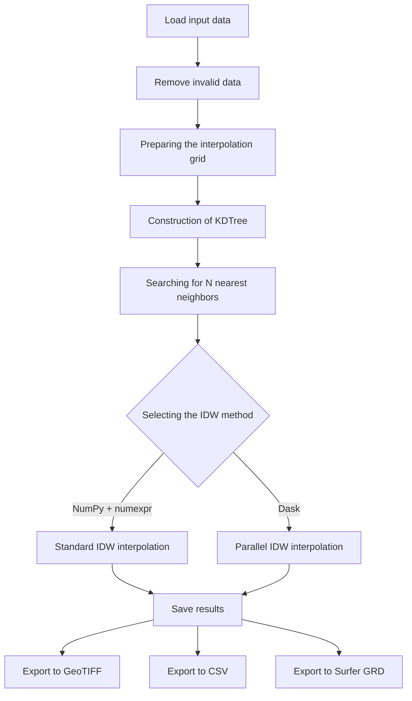
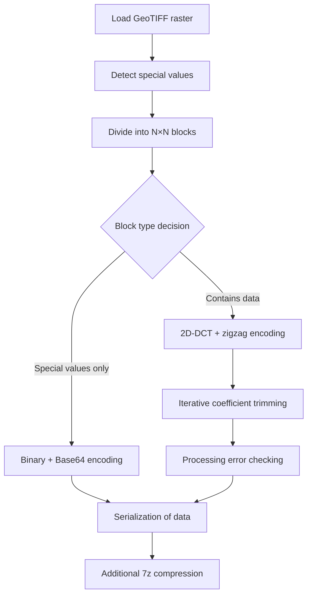

# FIDWaC: Fast Inverse Distance Weighting and Compression

**FIDWaC (Fast Inverse Distance Weighting and Compression)** is a toolkit in **Python** language whose main purpose is:
- **Fast creation of continuous surfaces** (rasters) from scattered measurement points using the IDW (Inverse Distance Weighting) method.
- **Lossy** compression** of the resulting raster data (GeoTIFF) using **Discrete Cosine Transform (DCT)** and zigzag encoding.

The package works well in a wide range of geoinformatics applications, including:
- bathymetry analysis,
- creation of numerical terrain models,
- shoreline monitoring,
- hydrology, climatology and other fields requiring efficient processing and archiving of large spatial data sets.

---

## Table of contents
1. [Features and functionalities](#features).
2. [Tool structure](#structure).
   1. [interpolation_FIT.py](#interpolation).
   2. [compression.py](#compression).
3. [Operation diagrams](#schemes).
   1. [Scheme of operation interpolation_FIT.py](#schema-interpolation).
   2. [Compression.py workflow](#schemat-compression).
4. [System requirements](#requirements).
5. [Configuration and startup](#configuration).
   1. [Example use of interpolation_FIT.py](#use-interpolation).
   2. [Example use of compression.py](#use-compression).
6. [Key functions](#key-functions).
7. [Advantages and potential uses](#benefits).
8. [Concluding remarks](#remarks).

---

<a name="features"></a>
## 1 Features and functionalities

### High-performance IDW interpolation.

1. **IDW** (Inverse Distance Weighting) method with a choice of calculations:
   - Based on `NumPy` and `numexpr` (for standard data sizes),
   - Based on `Dask` (for large sets and parallel calculations).
2. **KDTree** - using `scipy.spatial.cKDTree` for fast neighborhood search in point cloud.
3. flexible parameter selection:
   - Maximum search radius (**RMAX**),
   - Maximum number of neighbors (**NMAX**),
   - Minimum number of observations (**NMIN**).
4 Support for various input formats: `.shp`, `.las`, `.laz`, `.txt`, `.csv`.

### Compression of rasters using DCT

1. **2D-DCT** (discrete cosine transform) with zigzag coding.
2. Dynamic limiting of coefficients to achieve a preset error (quality controlled).
3. Masking of 0 and -9999 values (e.g., no data) using binary representation and additional Base64 compression.
4. saving as binary files (pickle, `.npy`) with archiving (`7z`).

---

<a name="structure"></a>.
## 2. Structure of the tool

### Main scripts

<a name="interpolation-fitpy"></a>.
#### 2.1 `interpolation_FIT.py`.
Script for **advanced interpolation of spatial data** using IDW method and KDTree structure.  
Allows you to create continuous models (GEOTIFF or Surfer GRID rasters) based on irregularly spaced points (e.g. `.forest`, `.csv`, `.shp`).

**Major program functions**:
- Read configuration (`config.json`): number of neighbors, resolution, maximum distance, IDW weights, among others.
- Removal of invalid values (NaN, -9999).
- Generating a grid (meshgrid) based on area boundaries.
- Use of `cKDTree` to find neighboring points.
- IDW interpolation function using NumPy or Dask.
- Exporting results to:
  - GeoTIFF,
  - CSV,
  - Surfer GRD (`.grd`).

**Key functions in the program**:
- `near_divided()` - rounding values to the nearest divisible by the given resolution.
- `calculate_idw()` - calculation of IDW interpolation using numexpr library.
- `calculate_idw_dask()` - calculation of IDW interpolation using Dask library for parallel calculations for very large data sets and small amount of RAM

**Proceedings**:
1. Load input data (`.shp`, `.las`, `.laz`, `.txt`, `.csv`).
2. automatic data cleaning (removing NaN and -9999 values)
3. creation of a grid for interpolation based on the data range
4. construction of KDTree distance tree for quick neighbor search
5. searching for N nearest neighbors for each grid point
6. calculating weights inversely proportional to the square of the distance
7. performing interpolation by IDW method using numexpr or Dask
8. exporting results in selected formats

<a name="compressionpy"></a>.
#### 2.2 `compression.py`.
Script for **lossy advanced compression of raster data** (e.g. GeoTIFF files) using discrete cosine transform and zigzag encoding.

**More important program functions**:
- Read configuration (`config.json`): including N×N block size, compression accuracy, DCT type.
- Automatic detection and handling of special values (0, -9999, NaN).
- Amine of Float to Integer values, which compress better.
- Division of raster into N×N blocks (`sliding_window_view` function).
- 2D-DCT and zigzag encoding for coefficients.
- Iterative pruning of coefficients to a given error rate.
- Binary serialization of missing data mask (pickle).
- Additional compression (e.g., `7z`).

**Key functions in the program**:
- `dct2()` and `idct2()` - 2D implementations of the discrete cosine transform and its inverse.
- `to_zigzag()` and `from_zigzag()` - 2D matrix conversion to/from zigzag format
- `check_precision_decompression_dct()` - error checking between the original matrix and the reconstructed one
- `refine_dct_array()` - iterative optimization of the number of DCT coefficients to achieve the set accuracy
- `matrix_to_binary_number()` and `binary_number_to_matrix()` - conversion of special value matrix (0, -9999) to/from binary representation with Base64 compression

**Proceedings**:
1. loading raster data (GeoTIFF).
2. identification of special values (0, -9999) in the data
3. division of the raster into N×N blocks
4. for each block:
   - Detection of blocks containing only special values (value 0 or -9999)
   - Application of 2D-DCT for blocks containing mixed data (data and 0 or -9999 values)
   - Application of 2D-DCT for blocks containing only data
   - Encoding of DCT coefficients using the zigzag method
   - Iterative pruning of coefficients to achieve the set error
   - Preparation of special value information in binary format with Base64 encoding (masks 0 and/or -9999)
5. saving the compressed data in binary format
6. additional compression of the resulting file using the 7z algorithm

---

<a name="schemes"></a>.
## 3. Action schemas

<a name="schema-interpolation"></a>.
### 3.1 The working scheme `interpolation_FIT.py`.



<a name="schema-compression"></a>.
### 3.2 The working schema `compression.py`.


---

<a name="requirements"></a>.
## 4. system requirements

### Software dependencies

- **Python** 3.7 or later.
- **NumPy** - basic operations on arrays and arrays.
- **SciPy** - implementation of KDTree and DCT transform.
- **numexpr** - acceleration of numerical calculations.
- Dask** - parallel computing for large data sets or computers with insufficient memory.
- rasterio** - support for GeoTIFF raster data.
- Pandas** - manipulation of tabular data
- Shapefile** - support for Shapefile format.
- laspy** - support for LAS/LAZ (point cloud) formats.
- 7z compression **py7zr** - 7z compression support
- **tqdm** - visualization of operation progress.

### Hardware requirements

- Multi-core processor (recommended for Dask mode)
- At least 8GB RAM (16GB+ recommended for larger data sets)
- Sufficient disk space to store input and output data
- The program runs on both windows and Linux.

---

<a name="configuration"></a>.
## 5. Configuration and startup

Configuration of the tool is done through the `config.json` file, which contains all the necessary parameters for both scripts.

### Example configuration for `interpolation_FIT.py`:

`json
{
  "results_directory": "./results/",
  "z_field_name": "Z",
  "N": 12,
  "resolution": 5,
  "max_distance": 100,
  "leafsize": 16,
  "weights": 1,
  "rasterCrs": "EPSG:2180",
  "save_data_to_shp": false,
  "idw_dask": true,
  "idw_numpy": false,
  "knn_calculate": true,
  "knn_image": true,
  "interpolation_image_create": true,
  "csv_result": true,
  "surfer_grd": false
}
```

### Example configuration for `compression.py`:

`json
{
  "results_directory": "./results_compression/",
  "source_directory": "./source/",
  "accuracy": 0.01,
  "matrix": 16,
  "decimal": 2,
  "type_dct": 2
}
```

<a name="use-interpolation"></a>.
### 5.1 Example use of `interpolation_FIT.py`.

You can run the script from the command line by specifying the path to the input file:

``bash
python interpolation_FIT.py ./data/points.shp
```

It is also possible to batch process multiple files using tools like `find` and `parallel`:

``bash
find ./data -name "*.las" | parallel python interpolation_FIT.py {}
```
Tange, O. (2022, November 22). GNU Parallel 20221122 ('Херсо́н').
Zenodo. https://doi.org/10.5281/zenodo.7347980

<a name="use-compression"></a>.
### 5.2 Example use of `compression.py`.

GeoTIFF raster compression:

``bash
python compression.py ./results/model.tif
```

Batch processing of multiple files:

``bash
find ./source -type f -name '*.tif' | parallel python compression.py {}
```

<a name="advantages"></a>
## 6 Advantages and potential applications

### Advantages

- **High performance** through the use of optimized libraries and algorithms.
- **Scalability** - ability to process both small and large data sets.
- **Controlled compression quality** - guarantee of maximum error with respect to source data.
- Low hardware requirements** for basic operation.
- **Parallel computation** for large data sets thanks to Dask.

### Potential applications

- **Hydrology and hydrography** - creating bathymetric models.
- Spatial information systems (GIS)** - LiDAR data processing.
- **Environmental monitoring** - shoreline and landform change analysis.
- Civil engineering** - creation of numerical terrain models (NMT).
- **Meteorology and climatology** - interpolation of measurement data from stations.

---

<a name="comments"></a>
## 7 Concluding remarks

FIDWaC is a state-of-the-art tool that combines high performance spatial interpolation with advanced data compression methods. With this solution, it is possible to efficiently process and archive large spatial data sets while maintaining control over the quality of the results.

The tool is under constant development, and its source code is available under an open-source license. We encourage comments, suggestions for improvement and participation in the development of the project.


